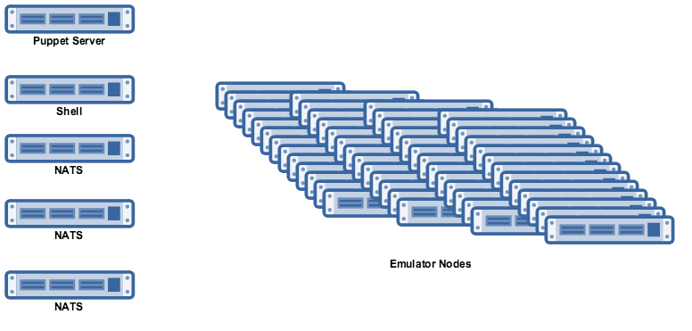

# Environment Setup 

## Requirements

You'll need the following:

  * A `Puppet Server`
  * 1 `Shell` node to run the tests from and gather stats
  * A number of `Emulator Nodes` to run the emulator on
  * 1, 3 or 5 nodes for `NATS` depending on your scenarios, these should not also run the emulator
  * Copies of `gnatsd`, `choria-emulator` and `go-choria` hosted on a reachable webserver
  * All the nodes set up with latest Choria and communicating with the Puppet Master over a dedicated NATS running on the Puppet Master (example, just not on the test nodes
  * The emulator nodes must have the `mcollective_agent_emulator` module deployed on them
  * The shell node need the `mcollective_agent_emulator` but only it's client




## Prepare Emulators

The emulators will need copies of `gnatsd`, `choria-emulator` and `go-choria` deployed on them, you can do this as follows:

```
% touch ~/.choria-emulator.yaml
% mco playbook run setup-prereqs.yaml 
   --emulator_url=https://shell.internal/choria-emulator-0.0.1 \
   --gnatsd_url=https://shell.internal/gnatsd \
   --choria_url=https://shell.internal/go-choria

```

The answers you supply here will be stored in `~/.choria-emulator.yaml` so next time you can leave off the arguments.

## Run the scenario

Individual scenario documentation will show you how to deploy and configure the emulator and test client. Use teh basic flat scenario to confirm it all works using a 10 count test.

After the run is completed you can stop the various parts using these commands:

```
$ mco playbook run stop-emulator.yaml
$ mco playbook run stop-nats.yaml
$ mco playbook run stop-federation.yaml
```

## Interpret the results

The test results are stored in directories like `reports/20170911-100024/` you can graph the stats using (TODO URL FOR A SHEET)